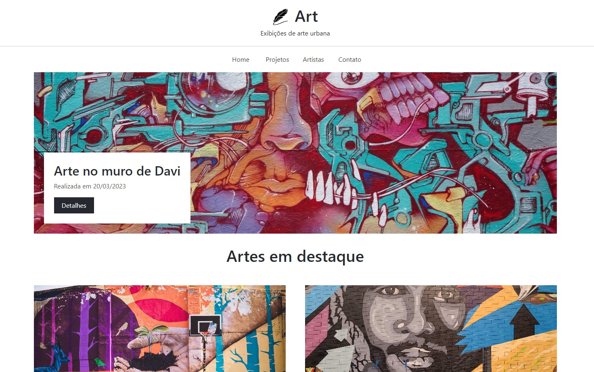

# Projeto Art

> Projeto de uma landing page responsiva feito com Bootstrap 5, html e css puro; usando também os ícones do próprio bootstrap.

## Imagem do projeto

## Tecnologias

- HTML
- CSS
- Bootstrap 5
- Git e Github

## O que aprendi

Neste projeto simples e inicial do curso de Boostrap, aprendi a usar melhor as classes de grid do Bootstrap.

Aprendi também a usar o Bootstrap Icons, os ícones do próprio Bootstrap. Muito mais prático e evita estarmos tendo que ir atrás de ícones em outros sites. Reunindo tudo em um só lugar.

## Deploy
[▶ Clique para acessar o projeto](https://alysson-leite.github.io/projeto-landing-page-art/)